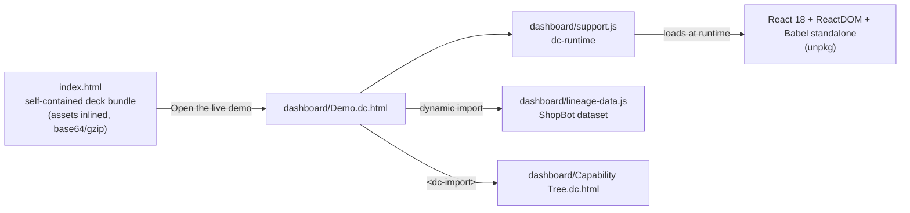

# INVARA: reproducibility proof for AI agents

Same intent, same plan, same execution: proven per intent, from the traces your agents already emit.

**Live:** https://chanman22git.github.io/Invara/ (pitch deck) · [Lineage Proof dashboard](https://chanman22git.github.io/Invara/dashboard/Demo.dc.html)

## Executive summary

- **What it is:** a product concept for continuous **reproducibility proof** for AI agents. It checks whether an agent still takes the same path it took last week, still runs the steps it is required to run, and still stays within its cost norms.
- **Who it's for:** platform, AI-engineering and risk teams that run AI agents on the critical path, and the leaders who need to answer: "when it runs again, will it do the same thing, and can we prove what it did?"
- **Status:** proof of concept. The repo contains a pitch deck and a clickable dashboard mockup (the "Lineage Proof" dashboard) populated with a fictional dataset for "ShopBot", a customer-service agent. It is not yet connected to live traces.
- **What it measures, and what it doesn't:** it measures *reliability* (same path, required steps ran, cost within norms). It explicitly does **not** measure correctness, safety, or a single health score. Every intent is scored on its own, never averaged.
- **Technical highlights:** the deck and the dashboard are static HTML built on `dc-runtime` (a small runtime that renders React components from HTML templates). No build step and no backend. Hosted on GitHub Pages.
- **Lineage:** this is the successor to [lineage-proof](https://github.com/Chanman22git/lineage-proof), an earlier single-file pitch deck for the same idea.

## The idea

Evals score an answer against a fixed answer key. Tracing and observability show what a single run did. Human reviewers don't scale. None of these answers the question "is this agent behaving *reliably*, right now?" Tolerated wobble then quietly becomes the new normal.

Invara reads the traces agents already emit and never re-runs an agent. It scores each **leaf** (one intent the agent handles, such as *Refund Eligibility* or *Delivery Status*) on independent signals:

| Signal | What it answers | How it's read |
|---|---|---|
| **Tier 1 · Consistency** | Is the agent taking its usual path? | Share of traces that follow the dominant *skeleton* (the sequence of skills, API calls and branches). Low means "investigate", never "fail". |
| **Tier 2 · Drift** | Has the path moved from this leaf's own baseline? | The movement over time, not the level. For example, the dominant path falling from 94% to 78% after a policy version ships. |
| **Tier 3 · Invariants** | Did the required steps run? | Violation rates for predicates such as "fetches current state before replying". Treated as a defect count. |
| **Tier 0 · Cost tripwire** | Is something looping? | Cost residual: actual cost minus the cost expected given the context. A smoke alarm kept out of the main grid. |

Design commitments that come through in both the deck and the dashboard:

- **No single score.** Trustworthiness has several dimensions, and one health number hides them.
- **Per intent, not per agent.** Leaves roll up into capability levels using **weakest-link** rollups, never a mean.
- **"Reliably wrong" is surfaced.** In the *money quadrant*, an intent is highly consistent *and* violating an invariant. Tier 1 alone can't see this.
- **The dashboard gates its own numbers.** Per-leaf figures are shown as *low-confidence* until the intent classifier's reproducibility clears a gate, and leaves below a traffic floor are flagged rather than scored.

## What's in the demo

### Pitch deck (`/`)

A full-screen, scroll-snapping deck with eight sections: cold open, problem statement, deterministic flows around non-deterministic LLMs, the trap (evals, observability and humans each have a blind spot), the core why (observability versus trustworthiness), the framework, what's inside Invara, and the ask.

- Navigate with `→` `↓` `PageDown` `Space` (next), `←` `↑` `PageUp` (previous), and `Home` / `End`.
- The **"Open the live demo"** button plays a short loading sequence and then opens `dashboard/Demo.dc.html`.

### Lineage Proof dashboard (`/dashboard/Demo.dc.html`)

An interactive mockup built on the fictional ShopBot dataset in `dashboard/lineage-data.js`. The dataset has 10 leaves across four capability levels (Order Status, Refunds, Product Inquiry, Account Management) plus a top-level Escalation leaf.

- **Header stats:** a classifier-reproducibility gate, leaves measured, leaves needing attention, new leaves over 7 days, and open tripwires.
- **Agent, team and org selectors** with a rolling 7-day window.
- **"Where to look first":** attention items ordered by severity, then stakes (never traffic). The demo data includes a money-quadrant case, a drift event, a cost-tripwire retry spiral, and a high-stakes leaf that is below the traffic floor.
- **Interactive capability tree:** expand and collapse the lineage, and click a node to see rolled-up min, median and max. There is also a grid with the per-leaf three-tuple (T1 consistency, T2 drift, T3 violation, tripwires) and a cost-per-intent table.
- **Leaf detail:** the dominant skeleton and the distribution over skeletons, the three tiers measured independently, the cost tripwire with flagged traces and a replay drill-down, and a scope reminder that the leaf is measured for reliability, not correctness.

## How it works



- **`dc-runtime`** (`support.js`) parses a page's `<x-dc>` template and its `<script data-dc-script>` component class, loads React, ReactDOM and Babel from unpkg, and renders the component. `<dc-import>` embeds another `.dc.html` component, which is how the Capability Tree is pulled into the dashboard.
- **`index.html`** is a bundled, standalone page. Its images, fonts and runtime are embedded as base64 (some gzip-compressed) in a manifest, and unpacked in the browser (`DecompressionStream`) on load.
- The dashboard loads `lineage-data.js` with `import('./lineage-data.js')`. Its headline stat bindings (`classifierVal`, `measuredVal`, …) resolve on first render while that import is still in flight (see the loading branch of `renderVals()` in `dashboard/Demo.dc.html`).

## Tech stack

- HTML, CSS and JavaScript (ES modules)
- `dc-runtime`: renders React 18 components from HTML templates, with Babel standalone for in-browser JSX transforms (loaded from unpkg)
- Google Fonts (IBM Plex Sans / Mono in the dashboard). Fonts are embedded in the deck bundle.
- GitHub Pages

## Project structure

```
Invara/
├── index.html                     # Pitch deck: standalone bundle (landing page)
├── .nojekyll                      # Serve files as-is (filenames contain spaces)
├── dashboard/                     # What the live site serves
│   ├── Demo.dc.html               # Lineage Proof dashboard
│   ├── Capability Tree.dc.html    # Tree component, imported by Demo
│   ├── lineage-data.js            # Fictional ShopBot dataset
│   └── support.js                 # dc-runtime (generated; do not edit)
└── source/                        # Design-reference originals (not linked from the site)
    ├── Invara v2 (standalone).html            # Deck source
    ├── Lineage Proof.dc.html                  # Dashboard prototype
    ├── Lineage Proof - Requirements.dc.html   # Product requirements draft (FR / OQ numbered)
    ├── Tree Visual Options.dc.html            # Explorations for the capability-tree visual
    ├── Capability Tree.dc.html
    ├── lineage-data.js
    └── support.js
```

`source/Lineage Proof - Requirements.dc.html` is a working-draft PRD that covers the summary, scope, measurement model, numbered functional requirements and open questions. Read it for the reasoning behind the dashboard.

## Running locally

Serve the repo root over HTTP. The dashboard uses a dynamic `import()` and `fetch`, which browsers block on `file://`.

```bash
git clone https://github.com/Chanman22git/Invara.git
cd Invara
python3 -m http.server 8000
# Deck:      http://localhost:8000/
# Dashboard: http://localhost:8000/dashboard/Demo.dc.html
```

An internet connection is needed, because React, ReactDOM and Babel are fetched from unpkg at runtime.

## Deployment

GitHub Pages is configured in **"Deploy from a branch"** mode: branch `main`, folder `/` (root). The repo has no GitHub Actions workflow. Pushing to `main` republishes the site, and `.nojekyll` makes Pages serve the space-containing filenames unchanged.

## Roadmap and known limitations

- **Demo data only.** The dashboard runs on a fictional, internally consistent dataset. The next step (the deck's "ask") is to build it on live traces. The deck names Galileo.ai and OpenTelemetry as the existing stack it would read from.
- **Prototype runtime.** Pages depend on `dc-runtime` and on unpkg at runtime, rather than a production build.
- **Duplicated files.** `dashboard/` and `source/` contain near-identical copies of the runtime, data and dashboard. Edits to the live site belong in `dashboard/` and `index.html`.
- **Tunable inputs.** As the dashboard's own caveats state, Tier 1 feature sets and Tier 2 thresholds are tunable rather than fixed, invariant coverage is still expanding, and cost-anomaly tuning is in progress.

## Author

**Chandru** ("BuiltByInstincts"), Product & Data Builder, Bengaluru. I build products at the intersection of AI, data, and human behaviour.

- Portfolio: https://chanman22git.github.io/builtbyinstincts/
- LinkedIn: https://linkedin.com/in/chandrasekarv22
